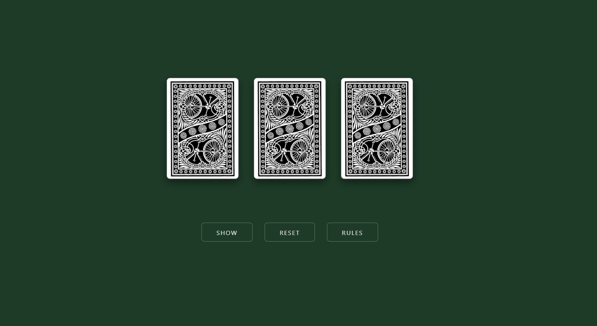
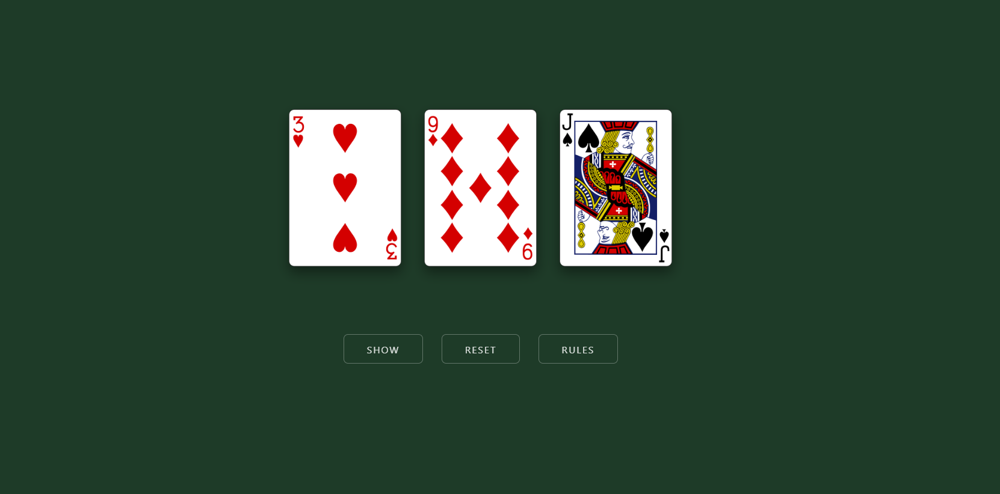
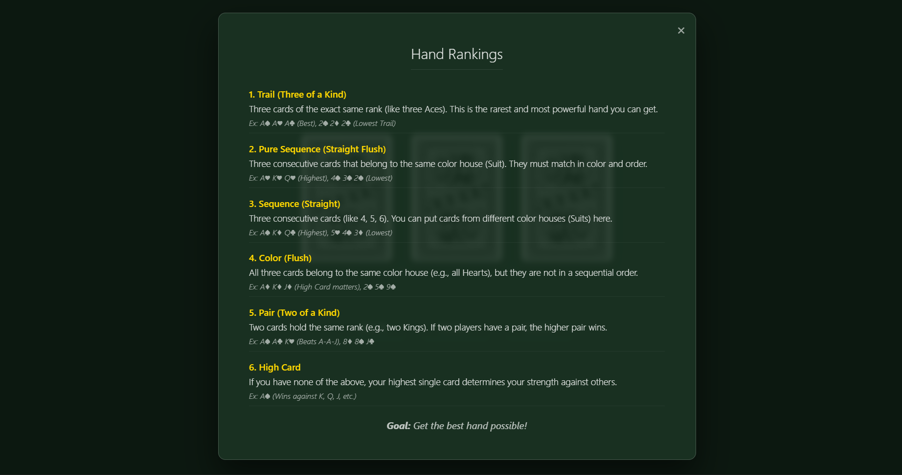

# 3 Patti: Color House Poker ♠️♥️

A simple, beginner-friendly web implementation of the classic Teen Patti card game.

## 🌟 Features

- **Beginner Friendly**: Authentic rules explained with simple, "Color House" terminology suitable for complete newcomers.
- **3D Animations**: Realistic 3D card flipping animations with staggered dealing effects.
- **Instant Reset**: innovative parallel-fetching logic ensures zero wait time between hands.
- **Mobile First**: Fully responsive design with touch-optimized controls (no tap delay).
- **Dark Theme**: A polished, deep green UI that mimics a premium card table experience.

## 📸 Screenshots

## 🎮 How to Play

1.  **Show**: Deal three new cards.
2.  **Reset**: Instantly clear the table and shuffle a new deck.
3.  **Rules**: Check the hand rankings (Trail, Pure Sequence, etc.) anytime.

## 🛠️ Tech Stack

- **HTML5**: Semantic structure.
- **CSS3**: Variables, Flexbox, 3D Transforms (Perspective, RotateY), and Media Queries.
- **JavaScript (ES6+)**: `async/await`, `fetch` API, and event handling.
- **API**: Powered by [Deck of Cards API](https://deckofcardsapi.com/).
